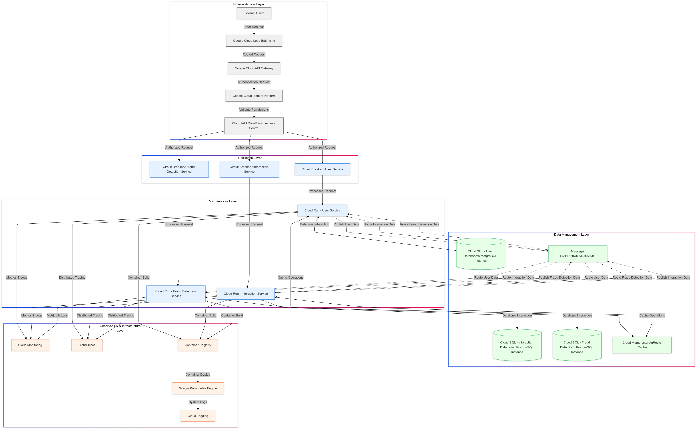

# Microservices System Architecture
Microservice architecture design for user-task.
## System Architecture Diagram

## Key Components and Layers
### 1. External Access Layer
#### Load Balancing: Distributes incoming traffic using Google Cloud Load Balancing
#### API Gateway: Manages and routes API requests
#### Authentication: Leverages Google Cloud Identity Platform
#### Authorization: Implements Role-Based Access Control (RBAC)

### 2. Resilience Layer
   Implements circuit breakers for each microservice to prevent cascading failures:

#### User Service Circuit Breaker
#### Interaction Service Circuit Breaker
#### Fraud Detection Service Circuit Breaker

### 3. Microservices Layer
   Three core microservices running on Cloud Run:

#### User Service: Manages user-related operations
#### Interaction Service: Handles user interactions
#### Fraud Detection Service: Monitors and prevents fraudulent activities

### 4. Data Management Layer

#### Databases: Cloud SQL PostgreSQL instances for each service
#### Caching: Cloud Memorystore (Redis) for high-performance data access
#### Message Broker: Kafka/RabbitMQ for asynchronous communication between services

### 5. Observability & Infrastructure Layer

#### Monitoring: Cloud Monitoring for system health
#### Logging: Centralized logging with Cloud Logging
#### Tracing: Distributed tracing with Cloud Trace
#### Deployment: Container Registry and Kubernetes Engine

## Security Features

### Identity and Access Management (IAM)
### Role-Based Access Control
### Secure API Gateway
### Circuit Breakers for system resilience
### Distributed tracing for security monitoring

## Key Architecture Principles

### Microservices architecture
### Decoupled services
### Event-driven communication
### Horizontal scalability
### Fault tolerance
### Comprehensive monitoring

## Data Flow

### User requests enter through load balancing
### API Gateway authenticates and authorizes requests
### Circuit breakers manage service resilience
### Microservices process requests
### Message broker facilitates inter-service communication
### Data stored in dedicated databases
### Redis cache improves performance
### Comprehensive monitoring tracks system health

## Technologies Used

### Google Cloud Platform
### Cloud Run
### Cloud SQL
### Kubernetes Engine
### Kafka/RabbitMQ
### Redis
### Cloud Monitoring
### Cloud Logging
### Cloud Trace

## Scalability and Performance

### Horizontal scaling through Kubernetes
### Caching with Redis
### Asynchronous messaging
### Circuit breaker pattern
### Efficient database design